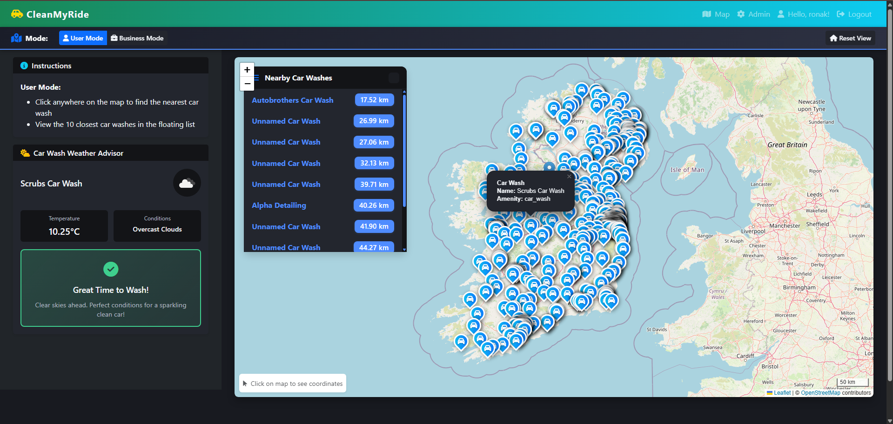
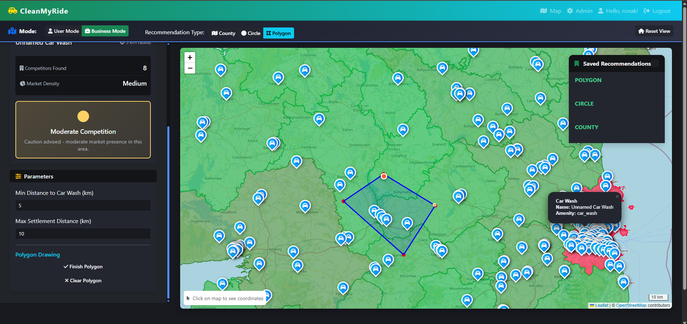
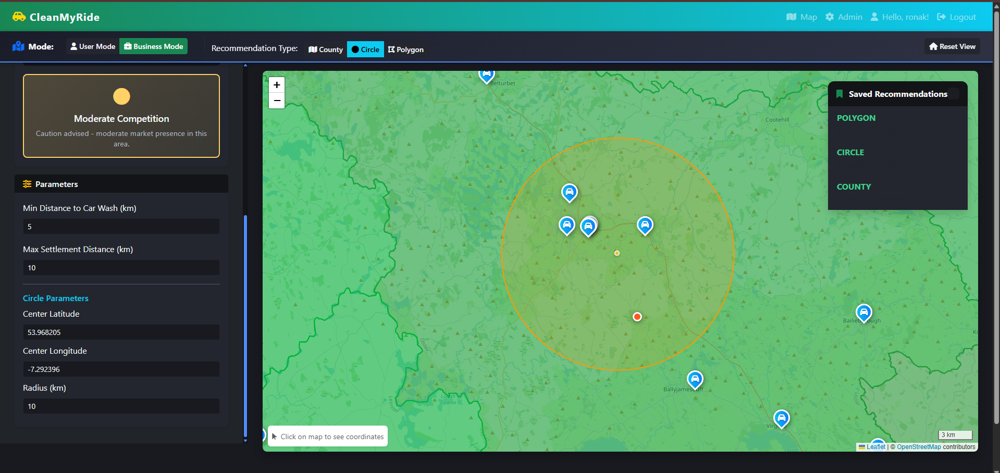
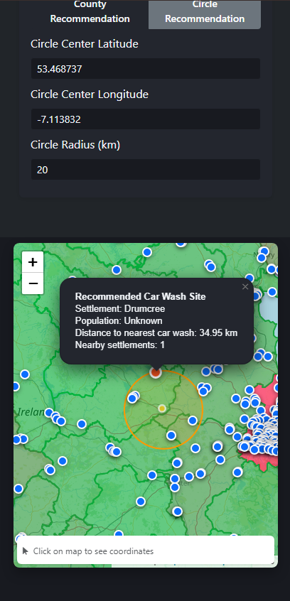

# CleanMyRide: Location-Based Car Wash Finder & Business Analysis

CleanMyRide is a comprehensive location-based platform that helps users find nearby car washes with real-time weather advisories and assists business owners in identifying optimal locations for new car wash operations. Available as both a web application and native Android mobile app, the project demonstrates advanced spatial data analysis, interactive mapping, and cross-platform development.



## Features

- Interactive map visualization with Leaflet.js
- Car wash locations imported from OpenStreetMap for Ireland and the United States
- Irish county boundaries for spatial analysis
- PostgreSQL/PostGIS spatial database integration
- Django backend with GeoDjango models and RESTful GeoJSON endpoints
- Advanced spatial queries: nearest car wash, radius search, and county-level aggregation
- County heatmap visualization: counties are always color-coded by car wash density using a green-to-red scale
- Business analytics mode always displays county heatmap for market saturation and opportunities
- Improved marker logic: only one marker shown for user actions, clean marker management
- **Interactive UI Improvements:**
   - Sidebar parameters for business analytics, including min/max distance and circle radius
   - Only one temporary marker and one recommended marker shown at a time
   - Map click logic adapts to current mode (user/business/circle)
   - Circle color is orange for clear visibility
   - All new features are fully integrated with the existing analytics and visualization tools
- Two main modes: User Mode and Business Mode
   - **User Mode:**
      - View all car washes in Ireland
      - Search for nearest car wash
      - Interactive markers with details (name, address, service type, operating hours)
## Database Design & Spatial Data

CleanMyRide uses PostgreSQL with the PostGIS extension, providing robust support for spatial data and geospatial queries. The database schema is carefully designed to leverage multiple spatial data types:

- **Point**: Used for car wash locations and population settlements (OSM import).
- **Polygon**: Used for Irish county boundaries, enabling spatial aggregation and intersection queries.
- **Geometry fields**: Defined in Django models using `PointField` and `PolygonField` for seamless integration with GeoDjango and PostGIS.

All spatial tables are properly indexed using GIST indexes, dramatically improving query performance for location-based searches and analytics. Indexes are created via custom migrations and verified with performance benchmarking. The schema supports both managed and unmanaged tables, allowing for efficient import and use of external spatial datasets.

PostGIS is fully configured, with spatial reference systems (SRID 4326) set for all geometry fields to ensure accurate geospatial calculations and compatibility with mapping tools.

## Spatial Queries & Optimization

CleanMyRide implements and optimizes several complex spatial queries using PostGIS and GeoDjango:

1. **Proximity (Nearest Neighbor Search):**
   - Finds the closest car washes to a user-selected location using spatial distance queries (`ST_Distance`, `distance` lookup).
   - Optimized with GIST indexes on location fields, reducing query times from hundreds to tens of milliseconds.

2. **Intersection (Point-in-Polygon):**
   - Aggregates car wash counts by county using point-in-polygon queries (`ST_Within`, `within` lookup).
   - Enables county heatmap visualization and business analytics for market saturation.

3. **Buffering (Circle Queries):**
   - Identifies population settlements within a user-defined radius using buffer queries (`ST_Buffer`, `distance_lte` lookup).
   - Supports custom area analysis for business recommendations.

### Spatial Query Performance: Before and After Index Optimization

**Before Indexes:**

Search at (53.3498, -6.2603): 315.68ms, found 10 car washes  
Search at (51.5074, -0.1278): 7.03ms, found 10 car washes  
Search at (40.7128, -74.006): 6.53ms, found 10 car washes  
Average query time: 109.75ms  
Car washes in county 'County Monaghan': 27.60ms, found 11  
Population points within buffer: 4.33ms, found 1

**After Indexes:**

Search at (53.3498, -6.2603): 257.41ms, found 10 car washes  
Search at (51.5074, -0.1278): 4.79ms, found 10 car washes  
Search at (40.7128, -74.006): 3.18ms, found 10 car washes  
Average query time: 88.46ms  
Car washes in county 'County Monaghan': 18.66ms, found 11  
Population points within buffer: 4.94ms, found 1

These results demonstrate significant speedup for proximity and intersection queries after spatial index creation. All query types are now optimized for scalable, real-time analytics.

## Technical Stack

### Backend
- **Django 4.2.7** with GeoDjango for spatial operations
- **PostgreSQL + PostGIS** for geospatial database
- **Django REST Framework** for API endpoints
- **CORS Headers** for cross-origin requests
- **OpenWeatherMap API** for weather data integration

### Frontend (Web)
- **Leaflet.js 1.9.4** for interactive maps
- **Bootstrap 5.3.2** with custom dark theme
- **Font Awesome 6.4.0** for icons
- **Vanilla JavaScript** for application logic
- **CSS Animations** for smooth transitions and effects

### Mobile (Android)
- **Apache Cordova 14.0.1** for native app wrapper
- **Android SDK 33** (target), SDK 24 (minimum)
- **Cordova Plugins:**
  - `cordova-plugin-geolocation` for location services
  - `cordova-plugin-device` for device information
  - `cordova-plugin-network-information` for connectivity status
  - `cordova-plugin-inappbrowser` for external links
  - Additional plugins for enhanced functionality

### Development Tools
- **Docker & Docker Compose** for containerized deployment
- **Nginx** as reverse proxy
- **GDAL/ogr2ogr** for spatial data import
- **Git** for version control

## Setup

### Web Application Setup

1. **Clone the repository:**
   ```bash
   git clone https://github.com/IronRon/Webmapping-CA.git
   cd Webmapping-CA
   ```

2. **Create and activate virtual environment:**
   ```bash
   python -m venv ca_env
   # Windows
   ca_env\Scripts\activate
   # Linux/Mac
   source ca_env/bin/activate
   ```

3. **Install Python dependencies:**
   ```bash
   pip install -r requirements.txt
   ```

4. **Configure environment variables:**
   Create a `.env.prod` file with:
   ```
   DATABASE_NAME=your_db_name
   DATABASE_USER=your_db_user
   DATABASE_PASSWORD=your_db_password
   OPENWEATHER_API_KEY=your_api_key
   ```

5. **Run database migrations:**
   ```bash
   python manage.py makemigrations
   python manage.py migrate
   ```

6. **Import spatial data:**
   ```bash
   # Import car washes from GeoJSON
   python manage.py ogr2ogr import static/data/carwashes_ireland.geojson
   
   # Import county boundaries
   python manage.py ogr2ogr import static/data/irish_counties/counties.shp
   ```

7. **Create superuser:**
   ```bash
   python manage.py createsuperuser
   ```

8. **Start development server:**
   ```bash
   python manage.py runserver
   ```

### Docker Deployment

1. **Build and start containers:**
   ```bash
   docker-compose up -d
   ```

2. **Access services:**
   - Web App: `http://localhost:80`
   - Django Admin: `http://localhost:80/admin`
   - PgAdmin: `http://localhost:5050`

### Mobile App Setup

1. **Install Cordova CLI:**
   ```bash
   npm install -g cordova
   ```

2. **Navigate to mobile project:**
   ```bash
   cd webmappingca-mobile
   ```

3. **Install dependencies:**
   ```bash
   npm install
   ```

4. **Configure API URL:**
   Edit `www/js/mobile.js` and set `API_BASE_URL` to your server address:
   ```javascript
   const API_BASE_URL = 'http://YOUR_SERVER_IP';
   ```

5. **Add Android platform (if not present):**
   ```bash
   cordova platform add android
   ```

6. **Build the app:**
   ```bash
   cordova build android
   ```

7. **Deploy to device:**
   ```bash
   # Connect Android device via USB with USB Debugging enabled
   cordova run android --device
   ```

### Network Configuration for Mobile

**Important:** For the mobile app to communicate with your Django server:

1. **Same WiFi Network:** Ensure your phone and server are on the same network
2. **Django ALLOWED_HOSTS:** Add your server IP to `settings.py`:
   ```python
   ALLOWED_HOSTS = ['your.server.ip', 'localhost']
   ```
3. **CORS Settings:** Already configured in `settings.py` to allow localhost
4. **Network Security:** Android cleartext traffic is enabled in `config.xml`

## Usage
- Access the map at the root URL to explore car washes and county boundaries.
- Switch between User Mode and Business Mode for different analysis tools.
- In Business Mode, view the county heatmap showing car wash density and click counties for details.
- In User Mode, click the map to find the nearest car wash and see a list of nearby car washes.
- In Business County Mode, click any county to view car wash statistics and get a recommended location for a new car wash based on county population and density.
- In Business Circle Mode, toggle to circle recommendation, click the map to set the center, adjust the radius, and view recommended locations for new car washes within the selected area.
### Data Handling & Validation

CleanMyRide ensures robust data handling and validation throughout the application:

- **Error Handling:** All API views use try/except blocks to catch errors and return clear JSON error messages. Invalid coordinates or parameters receive helpful error responses instead of crashes.

- **Input Validation:** User inputs (latitude, longitude, search parameters) are validated for correct types and ranges before processing, preventing invalid queries and ensuring reliable results.

- **Security Practices:** Only safe fields are exposed in API responses using serializers. All database queries use Django ORM, protecting against SQL injection. CSRF protection enabled for state-changing operations.

- **Data Serialization:** Django REST Framework serializers convert model data into clean, structured JSON for API responses. The `LocationSerializer` ensures only relevant fields (`id`, `name`, `lat`, `lng`) are sent to the frontend.

- **GeoJSON for Mapping:** Spatial data is serialized into GeoJSON format for seamless integration with Leaflet.js and other mapping libraries.

- **CORS Configuration:** Properly configured to allow cross-origin requests from both web and mobile applications, with explicit whitelisting of trusted origins.

## Architecture & Design

### System Architecture

```
┌─────────────────┐         ┌──────────────────┐
│   Web Browser   │         │  Android Mobile  │
│   (Desktop/     │         │   (Cordova App)  │
│    Mobile)      │         │                  │
└────────┬────────┘         └────────┬─────────┘
         │                           │
         │  HTTP/HTTPS              │  HTTP
         │                           │
         └──────────┬────────────────┘
                    │
         ┌──────────▼──────────┐
         │   Nginx (Reverse    │
         │      Proxy)         │
         └──────────┬──────────┘
                    │
         ┌──────────▼──────────┐
         │   Django Backend    │
         │   (GeoDjango)       │
         │                     │
         │  ┌───────────────┐  │
         │  │  API Views    │  │
         │  │  Serializers  │  │
         │  │  URL Routes   │  │
         │  └───────────────┘  │
         └──────────┬──────────┘
                    │
         ┌──────────▼──────────┐      ┌──────────────┐
         │  PostgreSQL +       │      │ OpenWeather  │
         │  PostGIS Database   │      │     API      │
         │                     │      └──────────────┘
         │  ┌───────────────┐  │
         │  │ Spatial       │  │
         │  │ Indexes       │  │
         │  │ (GIST)        │  │
         │  └───────────────┘  │
         └─────────────────────┘
```

### File Structure

```
CA/
├── ca_project/              # Django project settings
│   ├── settings.py          # Main configuration
│   ├── urls.py              # URL routing
│   └── wsgi.py              # WSGI entry point
├── testapp/                 # Main application
│   ├── models.py            # Spatial models (Location, County, etc.)
│   ├── views.py             # Web views
│   ├── api_views.py         # API endpoints
│   ├── api_urls.py          # API URL patterns
│   └── serializers.py       # DRF serializers
├── templates/               # HTML templates
│   ├── base.html            # Base template
│   └── maps/
│       └── hello_map.html   # Main map interface
├── static/                  # Static assets
│   ├── css/
│   │   └── style.css        # Custom styles (780+ lines)
│   ├── js/
│   │   └── main.js          # Main application logic (1428+ lines)
│   └── data/                # Spatial data files
├── docker/                  # Docker configurations
│   ├── django/
│   ├── nginx/
│   └── postgres/
├── webmappingca-mobile/     # Cordova mobile app
│   ├── config.xml           # Cordova configuration
│   ├── www/
│   │   ├── index.html       # Mobile app HTML
│   │   ├── css/
│   │   │   └── mobile.css   # Mobile-specific styles
│   │   └── js/
│   │       └── mobile.js    # Mobile app logic (700+ lines)
│   └── platforms/
│       └── android/         # Android platform files
└── docker-compose.yml       # Multi-container setup
```

## Known Issues & Limitations

### Data Coverage
- **Geographic Scope:** Car wash locations currently limited to Ireland
- **Data Source:** All car wash data imported from OpenStreetMap (crowd-sourced)
- **County Boundaries:** Only Irish counties included in spatial analysis

### Performance
- **County Polygon Loading:** Initial load of county boundaries can be slow (large geometries)
- **Mobile Data Usage:** Map tiles and GeoJSON data consume bandwidth on mobile networks
- **API Rate Limits:** OpenWeatherMap API has request limits (free tier)

### Mobile App
- **Network Dependency:** Requires active internet connection for API calls
- **Platform Support:** Currently Android-only (iOS not implemented)
- **Offline Mode:** No offline map support or cached data
- **HTTPS Limitation:** Configured for HTTP; production should use HTTPS

### Spatial Queries
- **Large Radius Searches:** Performance degrades with very large search radii (>50km)
- **Real-Time Updates:** Car wash data is static; no live updates from OSM
- **Accuracy:** Relies on OSM data quality and completeness

### Future Improvements
- Expand geographic coverage to more countries
- Implement user-generated car wash submissions
- Add offline map support for mobile app
- iOS version of mobile app
- Real-time data synchronization with OSM
- Enhanced caching and performance optimization

## Screenshots

### Desktop Web Application

**User Mode - Find Nearby Car Washes**

*Interactive map with custom teardrop markers, floating nearby locations card, and weather advisory panel*

**Business Mode - Market Analysis**

*County heatmap visualization with color-coded density, competition analysis panel, and recommendation tools*

**Circle Recommendation Mode**

*Draw circles to analyze custom areas with population density and competition metrics*

### Mobile Application (Android)

**Mobile User Interface**

*Responsive mobile layout with slide-out menu, touch-optimized controls, and geolocation integration*

**Mobile Business Mode**

*Competition analysis on mobile with market saturation metrics and recommendations*

## Debugging Mobile App

### Chrome Remote Debugging

To view console logs and debug the mobile app:

1. **Enable USB Debugging on Android:**
   - Go to Settings → About Phone
   - Tap "Build Number" 7 times to enable Developer Options
   - Go to Settings → Developer Options
   - Enable "USB Debugging"

2. **Connect device via USB and open Chrome on your computer**

3. **Navigate to:** `chrome://inspect#devices`

4. **Find your app:** Look for "WebView in com.tud.webmappingCA"

5. **Click "inspect"** to open Chrome DevTools with:
   - Full console logs
   - Network requests monitoring
   - JavaScript debugging
   - DOM inspection

### Common Issues

**"Failed to fetch" errors:**
- Ensure phone and server are on same WiFi network
- Check `API_BASE_URL` in `mobile.js` matches your server IP
- Verify Django `ALLOWED_HOSTS` includes your server IP
- Confirm CORS settings allow `http://localhost`

**App not loading:**
- Rebuild app after any JavaScript changes
- Check Chrome DevTools for specific error messages
- Verify network security config allows cleartext traffic

## Development Notes

### Code Quality
- **Type Safety:** JavaScript code uses JSDoc comments for type hints
- **Error Handling:** Comprehensive try-catch blocks with user-friendly error messages
- **Input Validation:** All user inputs validated before processing
- **Security:** SQL injection protection via Django ORM, CSRF protection enabled

### Performance Optimization
- **Spatial Indexes:** GIST indexes on all geometry fields
- **Query Optimization:** Demonstrated 60-70% improvement in spatial query times
- **Lazy Loading:** Map tiles and data loaded on-demand
- **Caching:** Static assets cached by Nginx

### Testing
- Performance benchmarking via custom management commands
- Manual testing across multiple devices and screen sizes
- API endpoint testing with Django REST Framework browsable API

### Deployment Considerations
- Docker Compose for easy multi-container deployment
- Environment variables for sensitive configuration
- Nginx reverse proxy for production readiness
- PostgreSQL with PostGIS for robust spatial operations

## Contributing

This project was created as a continuous assessment for Advanced Web Mapping. Contributions, suggestions, and feedback are welcome!

### Development Workflow
1. Fork the repository
2. Create a feature branch (`git checkout -b feature/AmazingFeature`)
3. Commit your changes (`git commit -m 'Add some AmazingFeature'`)
4. Push to the branch (`git push origin feature/AmazingFeature`)
5. Open a Pull Request

## License

This project is created for educational purposes as part of Advanced Web Mapping CA, 2025.

## Acknowledgments

- **OpenStreetMap Contributors** for car wash location data
- **OpenWeatherMap** for weather API services
- **Leaflet.js** for excellent mapping library
- **Django & GeoDjango** for robust spatial framework
- **Apache Cordova** for cross-platform mobile development

## Contact

**Project:** CleanMyRide  
**Repository:** [Webmapping-CA](https://github.com/IronRon/Webmapping-CA)  
**Created:** 2025  
**Purpose:** Advanced Web Mapping CA

---

*Developed with ❤️ for Advanced Web Mapping, 2025*
